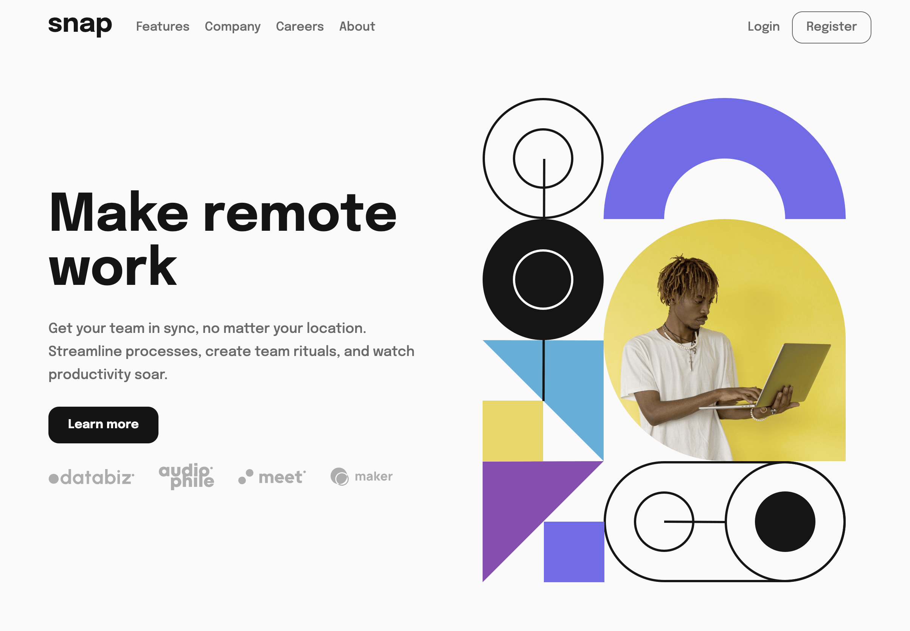

# Snap – Intro Section with Navigation

Refined one-page landing experience inspired by the Frontend Mentor challenge. It includes a responsive hero, anchored sections for Features, Company, Careers, and About, leadership highlights with photos, testimonials, blog cards, and a footer with social links.

## Table of contents
- [Overview](#overview)
- [Features](#features)
- [Tech](#tech)
- [Getting started](#getting-started)
- [What I learned](#what-i-learned)
- [Future improvements](#future-improvements)
- [Author](#author)

## Overview
This build keeps the original spirit of the challenge while adding fuller content and interactions:
- Responsive layout for desktop and mobile.
- Smooth anchor navigation (including simplified top nav without dropdowns).
- Hero CTA, feature highlights, company/story section, About with leadership photos, testimonials, blog/resource cards, and a careers CTA.
- Light, softened shadows and consistent spacing.

## Features
- **Responsive hero** with picture sources for desktop/mobile and client logos.
- **Anchored navigation**: Features, Company, Careers, About.
- **Sections**: feature grid, company story/stats, About values + leadership photos, testimonials, blog/resources, careers CTA with open roles.
- **Footer** with social icons and quick links.
- **Accessible interactions**: focusable controls, smooth scrolling, ESC to close mobile drawer.

## Tech
- HTML5 + CSS (Grid/Flex, custom properties)
- Vanilla JS for mobile drawer behaviors
- No build step required

## Getting started
1) Clone the repo  
2) Open `index.html` directly in your browser (or serve locally with any static server).

## What I learned
- Balancing card spacing and subtle depth without heavy shadows.
- Keeping navigation simple (links vs. dropdowns) improves layout clarity and accessibility.
- Smooth scrolling and scroll-margin help anchor targets land neatly below a fixed header area.

## Future improvements
- Add a resources page and refine blog cards with real links.
- Enhance mobile nav with focus trapping and initial focus on open.
- Wire a lightweight form for “Register”/”See open roles”.

## Author
- Ben Oluoch  
- Frontend Mentor: coming soon  
- GitHub: coming soon
